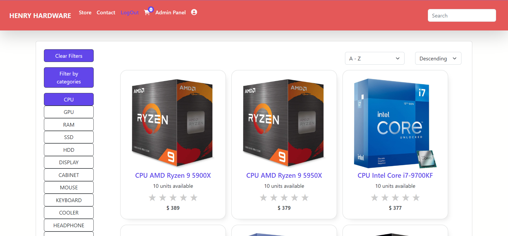
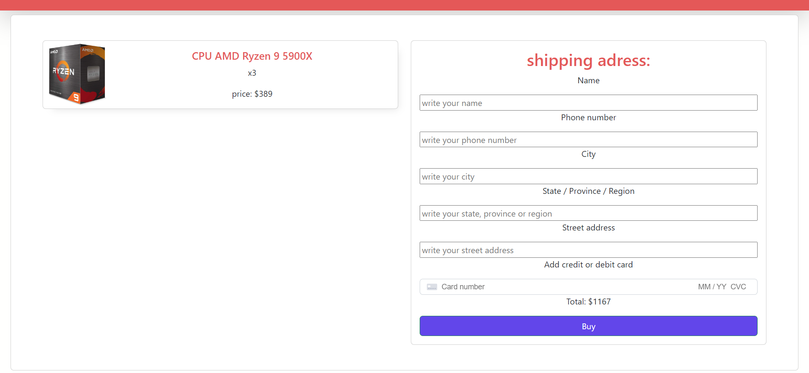
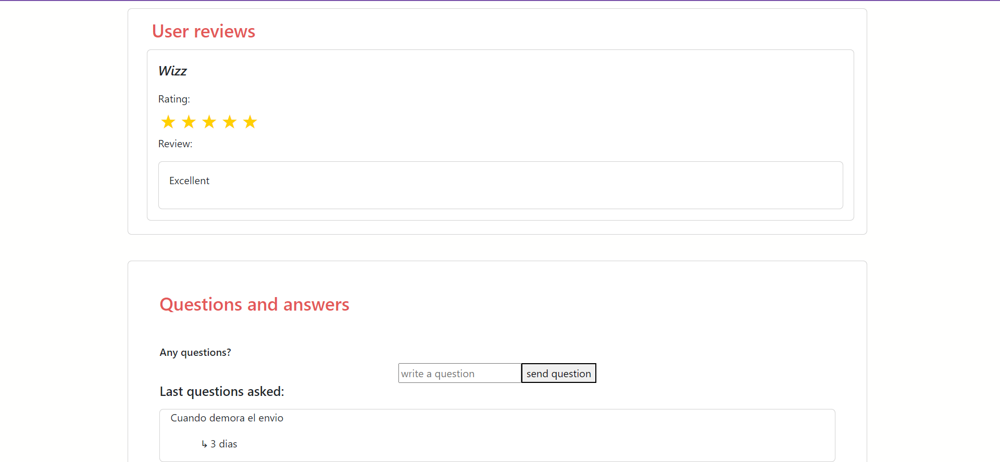
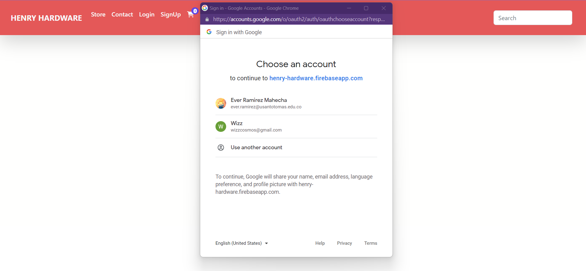
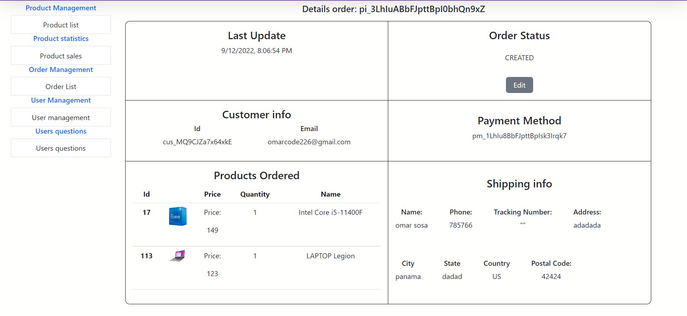
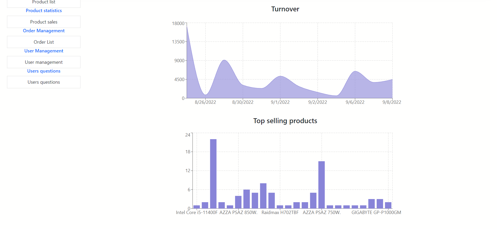
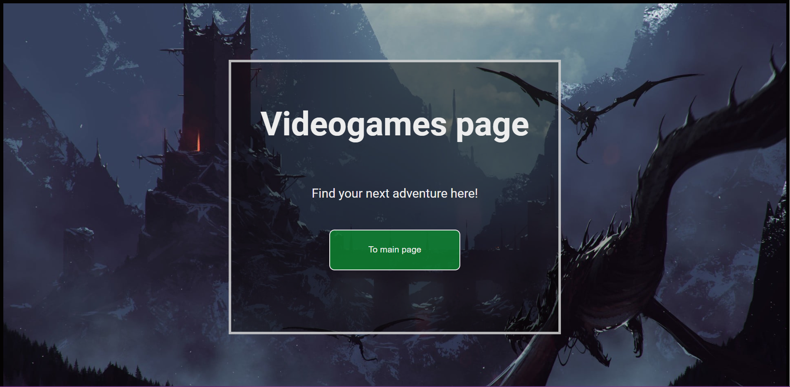
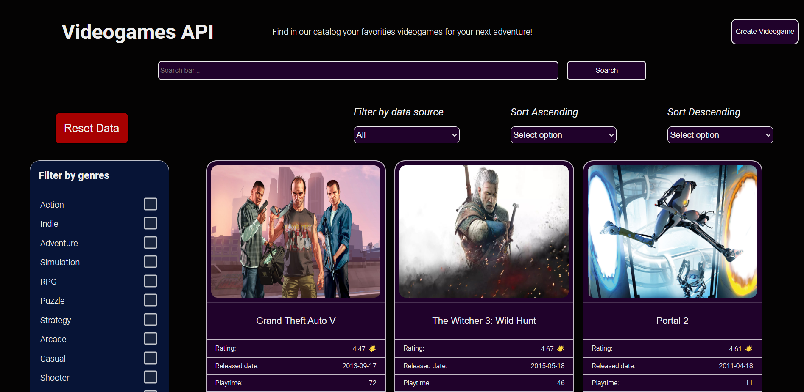
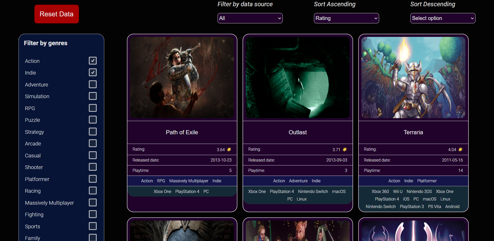
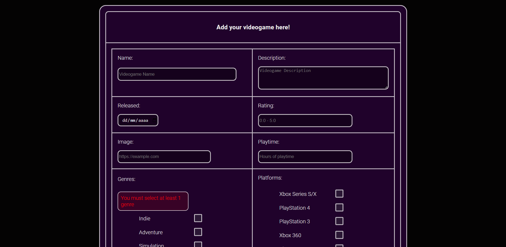

# Hola! soy Ever Ramirez

Desarrollador FullStack 💻 e Ingeniero Ambiental 🌿

Tengo 2 años de experencia como desarrollador, en donde he participado en la construcción de varias aplicaciones web en sectores como contabilidad, salud, cadena de suministro, e-commerce, tramites gubernamentales, entre otros; en estos proyectos fortalecí mis habilidades técnicas sobre el manejo de lenguajes de programación, frameworks y librerías como JavaScript, TypeScript, Angular, React, MongoDB, PostgreSQL, Node.js, Express.js, Java, Spring Boot, Docker, Microservicios, TailwindCSS y Metodologías Agiles para gestión de proyecto. Además, he desarrollado y fortalecido varias de mis competencias como el trabajo en equipo, gestión del tiempo, orientación a resultados, capacidad de análisis, adaptabilidad e innovación.

Actualmente me encuentro en busca de nuevas oportunidades, por lo que si te gusta mi perfil y quieres conocer más puedes contactarme al correo: ever.ramirezmahecha@gmail.com

También encontraras adjunto mi portafolio en donde puedes encontrar los proyectos tanto personales como profesionales que he desarrollado.

Mi portafolio:

<a href="https://portafolio-ever.vercel.app/" target="_blank" rel="noopener noreferrer" ></img></a>

Mi perfil en LinkedIn:

<a href="https://www.linkedin.com/in/ever-ramirez-mahecha-8b6708137/" target="_blank" rel="noopener noreferrer" ></img></a>

# Habilidades técnicas

## Lenguajes de programación

 
    
    &nbsp;&nbsp;&nbsp;&nbsp;&nbsp;&nbsp;&nbsp;&nbsp;&nbsp;&nbsp;&nbsp; 
    
    &nbsp;&nbsp;&nbsp;&nbsp;&nbsp;&nbsp;&nbsp;&nbsp;&nbsp;&nbsp;&nbsp;
    
    &nbsp;&nbsp;&nbsp;&nbsp;&nbsp;&nbsp;&nbsp;&nbsp;&nbsp;&nbsp;&nbsp;  
    

## Desarrollo Frontend

 

&nbsp;&nbsp;&nbsp;&nbsp;&nbsp;&nbsp;&nbsp;&nbsp;&nbsp;&nbsp;&nbsp; 

&nbsp;&nbsp;&nbsp;&nbsp;&nbsp;&nbsp;&nbsp;&nbsp;&nbsp;&nbsp;&nbsp; 

&nbsp;&nbsp;&nbsp;&nbsp;&nbsp;&nbsp;&nbsp;&nbsp;&nbsp;&nbsp;&nbsp; 

&nbsp;&nbsp;&nbsp;&nbsp;&nbsp;&nbsp;&nbsp;&nbsp;&nbsp;&nbsp;&nbsp;

## Desarrollo Backend

&nbsp;&nbsp;&nbsp;&nbsp;&nbsp;&nbsp;&nbsp;&nbsp;&nbsp;&nbsp;&nbsp;&nbsp;&nbsp;&nbsp;&nbsp;&nbsp;&nbsp;&nbsp;&nbsp;&nbsp;&nbsp;&nbsp;

## Bases de datos

&nbsp;&nbsp;&nbsp;&nbsp;&nbsp;&nbsp;&nbsp;&nbsp;&nbsp;&nbsp;&nbsp;&nbsp;&nbsp;&nbsp;&nbsp;&nbsp;&nbsp;&nbsp;&nbsp;&nbsp;&nbsp;&nbsp;

## Tecnologías en proceso de aprendizaje

Actualmente me encuentro aprendiendo más sobre estas habilidades técnicas

&nbsp;&nbsp;&nbsp;&nbsp;&nbsp;&nbsp;&nbsp;&nbsp;&nbsp;&nbsp;&nbsp;&nbsp;&nbsp;&nbsp;&nbsp;&nbsp;&nbsp;&nbsp;&nbsp;&nbsp;&nbsp;&nbsp;

# Mis proyectos

## Henry Hardware

Repositorio en GitHub:

<a href="https://github.com/Wizzaisha/Proyecto-Grupal-Componentes-PC">Project Henry Hardware</a>

Link del deploy del proyecto:

<a href="https://proyecto-grupal-componentes-3zjq7qgo7-wizzaisha.vercel.app/">Deploy Henry Hardware</a>

Descripción:

- Diseñar una aplicación web para la venta y comercialización de componentes de computadores.
- Desarrollar distintos tipos de funcionalidades como: visualización de productos, detalles, seguimientos a las ordenes de compra, registro de usuarios, ingreso de usuarios, control de inventario, seguimiento a las ordenes de compra, entre otros.
- Realizar la aplicación utilizando tecnologías y/o librerías como: React.js, Node.js, Express.js, CSS, Bootstrap, PostgreSQL, Sequelize.

</img>;&nbsp;</img>

</img>;&nbsp;</img>

</img>;&nbsp;</img>

 

 

## Videogames API

Repositorio en GitHub:

<a href="https://github.com/Wizzaisha/PI---Videogames">Videogames API</a>

Descripción:

- Construir una APP de videojuegos que utilizara y/o consumiera los datos de la API RAWG.
- Realizar funcionalidades como: visualización de cada uno de los videojuegos de la API en la pagina principal, filtrado de la información por categorías y plataformas, ordenado de la información por rating, orden aflabético y fecha de publicación, barra de busqueda y creación / añadir nuevos videojuegos a la base de datos propia.
- Utilizar tecnologías como: React.js, JavaScript, Node.js, Express.js, PostgreSQL y CSS puro.

</img>;&nbsp;</img>

</img>;&nbsp;</img>

