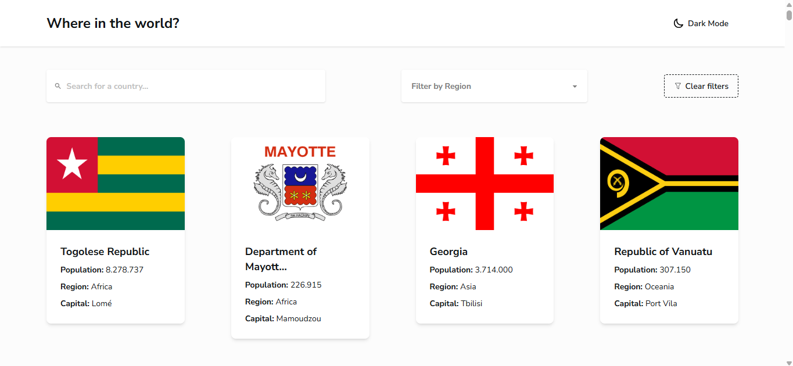
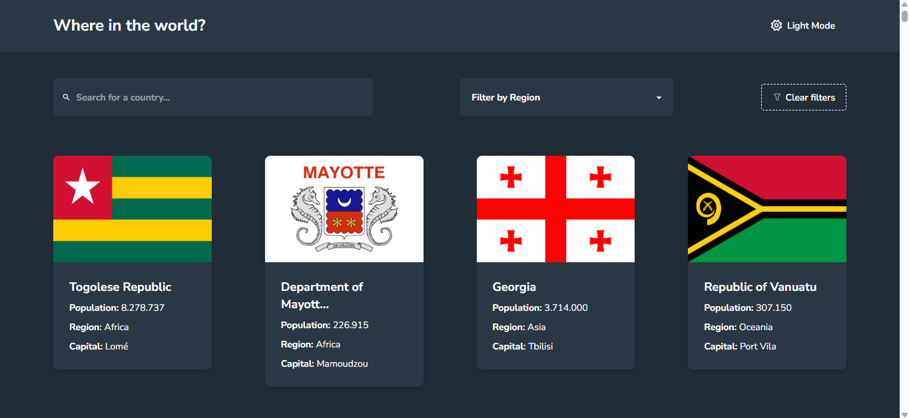
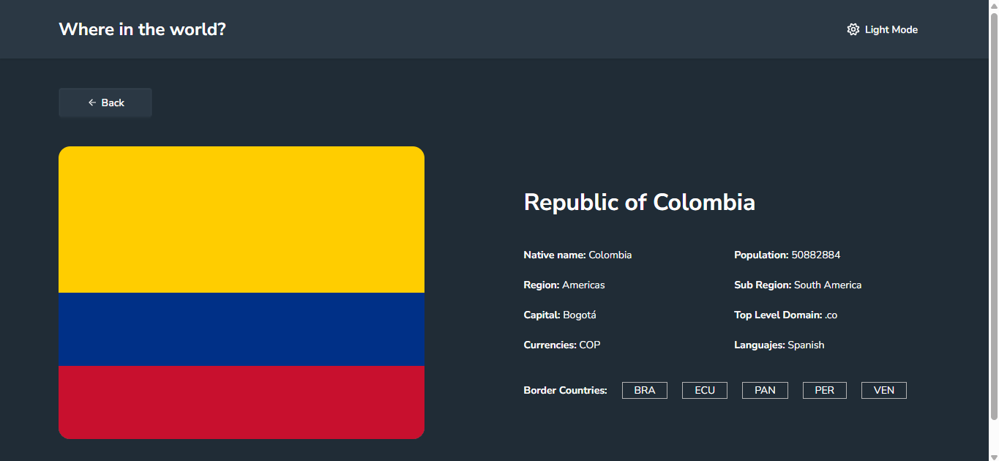
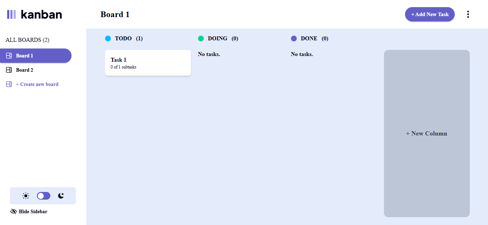
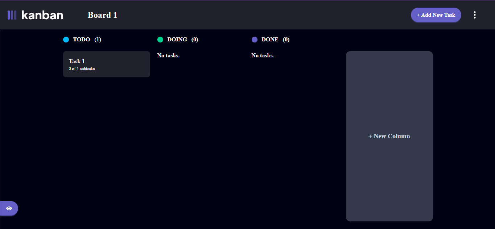
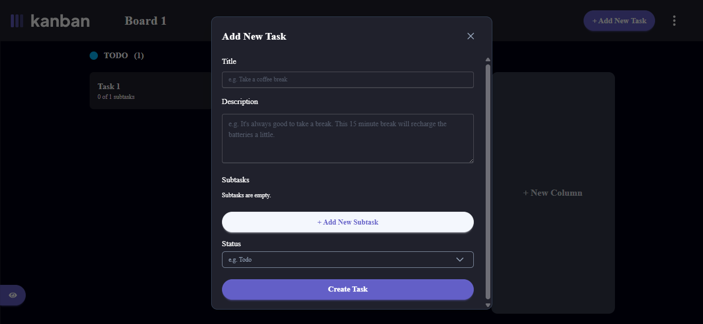
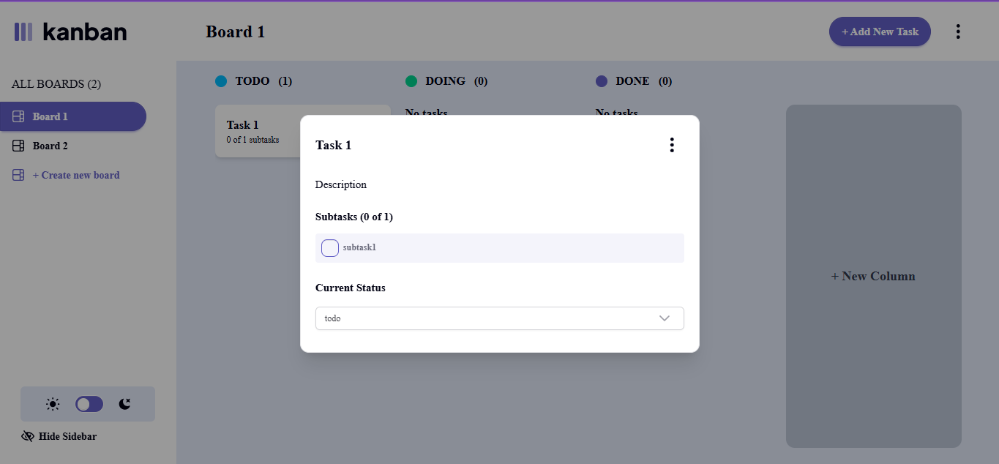

# Hola! soy Ever Ramirez

Desarrollador FullStack 💻 e Ingeniero Ambiental 🌿

Tengo 2 años de experencia como desarrollador, en donde he participado en la construcción de varias aplicaciones web en sectores como contabilidad, salud, cadena de suministro, e-commerce, tramites gubernamentales, entre otros; en estos proyectos fortalecí mis habilidades técnicas sobre el manejo de lenguajes de programación, frameworks y librerías como JavaScript, TypeScript, Angular, React, MongoDB, PostgreSQL, Node.js, Express.js, Java, Spring Boot, Docker, Microservicios, TailwindCSS y Metodologías Agiles para gestión de proyecto. Además, he desarrollado y fortalecido varias de mis competencias como el trabajo en equipo, gestión del tiempo, orientación a resultados, capacidad de análisis, adaptabilidad e innovación.

Actualmente me encuentro en busca de nuevas oportunidades, por lo que si te gusta mi perfil y quieres conocer más puedes contactarme al correo: ever.ramirezmahecha@gmail.com

También encontraras adjunto mi portafolio en donde puedes encontrar los proyectos tanto personales como profesionales que he desarrollado.

Mi portafolio:

<a href="https://portafolio-ever.vercel.app/" target="_blank" rel="noopener noreferrer" ></img></a>

Mi perfil en LinkedIn:

<a href="https://www.linkedin.com/in/ever-ramirez-mahecha-8b6708137/" target="_blank" rel="noopener noreferrer" ></img></a>

# Habilidades técnicas

## Lenguajes de programación

 
    
    &nbsp;&nbsp;&nbsp;&nbsp;&nbsp;&nbsp;&nbsp;&nbsp;&nbsp;&nbsp;&nbsp; 
    
    &nbsp;&nbsp;&nbsp;&nbsp;&nbsp;&nbsp;&nbsp;&nbsp;&nbsp;&nbsp;&nbsp;
    
    &nbsp;&nbsp;&nbsp;&nbsp;&nbsp;&nbsp;&nbsp;&nbsp;&nbsp;&nbsp;&nbsp;  
    

## Desarrollo Frontend

 
    
    &nbsp;&nbsp;&nbsp;&nbsp;&nbsp;&nbsp;&nbsp;&nbsp;&nbsp;&nbsp;&nbsp; 
    
    &nbsp;&nbsp;&nbsp;&nbsp;&nbsp;&nbsp;&nbsp;&nbsp;&nbsp;&nbsp;&nbsp; 
    
    &nbsp;&nbsp;&nbsp;&nbsp;&nbsp;&nbsp;&nbsp;&nbsp;&nbsp;&nbsp;&nbsp;
    
    &nbsp;&nbsp;&nbsp;&nbsp;&nbsp;&nbsp;&nbsp;&nbsp;&nbsp;&nbsp;&nbsp;  
    
    &nbsp;&nbsp;&nbsp;&nbsp;&nbsp;&nbsp;&nbsp;&nbsp;&nbsp;&nbsp;&nbsp; 
    
    &nbsp;&nbsp;&nbsp;&nbsp;&nbsp;&nbsp;&nbsp;&nbsp;&nbsp;&nbsp;&nbsp;
    

## Desarrollo Backend

    
    &nbsp;&nbsp;&nbsp;&nbsp;&nbsp;&nbsp;&nbsp;&nbsp;&nbsp;&nbsp;&nbsp; 
    
    &nbsp;&nbsp;&nbsp;&nbsp;&nbsp;&nbsp;&nbsp;&nbsp;&nbsp;&nbsp;&nbsp; 
    

## Bases de datos

    
    &nbsp;&nbsp;&nbsp;&nbsp;&nbsp;&nbsp;&nbsp;&nbsp;&nbsp;&nbsp;&nbsp; 
    
    &nbsp;&nbsp;&nbsp;&nbsp;&nbsp;&nbsp;&nbsp;&nbsp;&nbsp;&nbsp;&nbsp; 
    

## Tecnologías en proceso de aprendizaje

Actualmente me encuentro aprendiendo más sobre estas habilidades técnicas

    
    &nbsp;&nbsp;&nbsp;&nbsp;&nbsp;&nbsp;&nbsp;&nbsp;&nbsp;&nbsp;&nbsp; 
    

# Proyectos profesionales

## ApiGlobal

Repositorio en GitHub:

<!-- <a href="">Project Henry Hardware</a> --> N.A.

Link del deploy del proyecto:

<!-- <a href="https://proyecto-grupal-componentes-3zjq7qgo7-wizzaisha.vercel.app/">ApiGlobal</a> --> N.A.

Descripción:

- Migrar la aplicación de la empresa en versión de Angular 12 a la versión de Angular 18
  basada en módulos, con toda su lógica correspondiente, la cual cuenta con más de 41
  módulos o vistas principales. Y apoyándose para la generación de estilos con TailwindCSS y
  el control de estados con NGRX.
- Optimizar la lógica de los módulos migrados por medio de una refactorización de estos para
  mejorar los tiempos de renderizado y la visualización de la información dentro de la vista;
  siguiendo los principios SOLID para garantizar un código limpio y reutilizable.
- Conectar y optimizar la conexión de los endpoints provenientes del backend, manejando los
  estados de error o respuesta exitosa dependiendo del caso.
- Construcción de componentes reutilizables como Inputs, Modales, Botones, Selectores, entre
  otros para evitar el reusó de código de manera innecesaria y tener una consistencia de
  estilos a lo largo de la aplicación.
- Mejorar la lógica para la sesión del usuario para refrescar y obtener el token utilizando
  Firebase por medio de interceptores.
- Configurar y utilizar NGRX para la gestión de estados dentro de la aplicación y garantizar un
  flujo claro y que se actualicen los datos de forma correcta cuando se genera alguna acción.
- Mejorar la estructura de carpetas (scaffolding) con el fin de mantener una estructura clara,
  sencilla y de fácil estabilidad y mantenimiento para la aplicación.
- Apoyar al equipo backend con tareas relacionadas a requisitos para la construcción o
  modificación de nuevas vistas y el flujo de datos para estos.

    </img>
    &nbsp;
    </img>

    </img>
    &nbsp;
    </img>

 

 

# Proyectos personales

## CountriesAPI Page (Reto de Frontendmentor)

Repositorio en GitHub:

<a href="https://github.com/Wizzaisha/api-countries">api-countries</a>

Link del deploy del proyecto:

<a href="https://api-countries-git-main-wizzaishas-projects.vercel.app/">live-site</a>

Descripción:

- Integrar la API "Rest Countries API" para traer y visualizar data de los paises en una lista y un detalle de estos.
- Realizar un botón para el cambio de tema de la aplicación (oscuro - claro).
- Tecnologias usadas: React.ts - Vite, TailwindCSS, Redux.

    </img>
    &nbsp;
    </img>

    </img>

## Kanban Task Management App (Reto de Frontendmentor)

Repositorio en GitHub:

<a href="https://github.com/Wizzaisha/kanban-front2">client</a>
<a href="https://github.com/Wizzaisha/kanban-back2">api</a>

Link del deploy del proyecto:

<a href="https://kanban-client-six.vercel.app/">live-site</a>

Descripción:

- Construir una aplicación completamente funcional para la gestión de tareas con un cambio de tema (oscuro - claro).
- Realizar una api en Java Spring Boot para gestionar la creación, obtención, actualización y eliminación de las actividades y tableros.
- Tecnologias usadas: Angular, Spring Boot, MySQL, TailwindCSS, NgRx.

    </img>
    &nbsp;
    </img>

    </img>
    &nbsp;
    </img>

